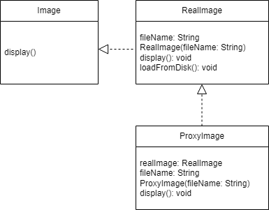

# Padrões de Projeto:
### Demonstração da implementação dos padrões de projeto Prototype, Proxy e Command em Java.

# Prototype:

## O que é o Padrão Prototype?

O padrão Prototype é um padrão de criação que permite criar novos objetos a partir de um protótipo existente. Em vez de instanciar um objeto do zero, você clona um objeto já configurado e personaliza-o conforme necessário.

## Diagrama UML


## Como funciona?

1. **Criação do protótipo:** Um objeto é criado com valores padrão.
2. **Clonagem:** Um novo objeto é criado como uma cópia do protótipo.
3. **Personalização:** O novo objeto pode ser personalizado com valores diferentes.

## Implementação

Neste projeto, temos:

* **Produto:** Interface que define o contrato para todos os objetos que podem ser clonados.
* **Camisa:** Classe concreta que implementa a interface Produto e representa uma camisa. O método `clonar()` cria uma nova instância de Camisa, copiando os atributos da camisa original.
* **Main:** Classe principal que demonstra o uso do padrão, criando uma camisa e clonando-a.

## Exemplo de Uso

```java
// Criando uma camisa vermelha
Camisa camisaVermelha = new Camisa("Camisa básica", 29.99, "M", "Vermelha");

// Clonando a camisa vermelha para criar uma camisa azul
Camisa camisaAzul = (Camisa) camisaVermelha.clone();

// Imprimindo as informações das camisetas
System.out.println("Camisa Vermelha:");
System.out.println(camisaVermelha);

System.out.println("\nCamisa Azul:");
System.out.println(camisaAzul);
```
# Proxy: 

## O que é o Padrão Proxy?

O padrão Proxy fornece um substituto ou espaço reservado para outro objeto. Ele controla o acesso ao objeto real, permitindo que você realize ações antes ou depois da solicitação chegar ao objeto original.

## Diagrama UML



## Como funciona?

1. **Criação do proxy:** Um objeto proxy é criado, encapsulando o objeto real.
2. **Solicitações:** Quando uma solicitação é feita ao proxy, ele pode realizar algumas ações antes de encaminhá-la ao objeto real.
   Encaminhamento da solicitação: O proxy encaminha a solicitação ao objeto real.
3. **Retorno da resposta:** O proxy pode realizar ações adicionais com a resposta antes de retorná-la ao cliente.

## Implementação

Neste projeto, temos:

* **Image:** Interface que define o contrato para a exibição de imagens.
* **RealImage:** Classe concreta que implementa a interface Image e representa a imagem real. Carrega a imagem do disco e a exibe.
* **ProxyImage:** Classe proxy que também implementa a interface Image e controla o acesso ao objeto RealImage. Carrega a imagem real sob demanda e delega a exibição para o objeto real.
* **Main:** Classe principal que demonstra o uso do padrão Proxy, criando um proxy para uma imagem e chamando o método display().

## Exemplo de Uso

```java
ProxyImage proxyImage = new ProxyImage("foto.jpg");
proxyImage.display();
```
# Command:

## O que é o Padrão Command?

O padrão Command é um padrão que transforma uma solicitação em um objeto independente que contém todas as informações sobre a solicitação. Ele permite que você parametrize métodos com diferentes solicitações, atrase ou faça fila de uma solicitação e suporte operações que podem ser desfeitas.

## Diagrama UML


## Como funciona?

1. **Criação do comando:** Um objeto de comando é criado com informações específicas.
2. **Execução:** O comando é executado pelo invocador.
3. **Desfazer:** O comando pode ser desfeito, revertendo a ação.

## Implementação

Neste projeto, temos:

* **Command:** Interface que define o contrato para todos os comandos, com métodos execute() e undo().
* **LightOnCommand, LightOffCommand, FanOnCommand, FanOffCommand:** Classes concretas que implementam a interface Command e representam comandos específicos para ligar e desligar a luz e o ventilador.
* **RemoteControl:** Classe invocadora que armazena e executa comandos.
* **Light, Fan:** Classes receptoras que executam as ações reais.

## Exemplo de Uso

```java
// Criando os objetos receptores
Light light = new Light();
Fan fan = new Fan();

// Criando os comandos
Command lightOn = new LightOnCommand(light);
Command lightOff = new LightOffCommand(light);
Command fanOn = new FanOnCommand(fan);
Command fanOff = new FanOffCommand(fan);

// Criando o controle remoto
RemoteControl remote = new RemoteControl();

// Ligando a luz
remote.setCommand(lightOn);
remote.pressButton();
remote.pressUndo();

// Desligando a luz
remote.setCommand(lightOff);
remote.pressButton();
remote.pressUndo();
```